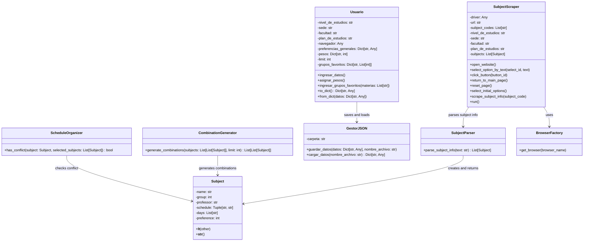
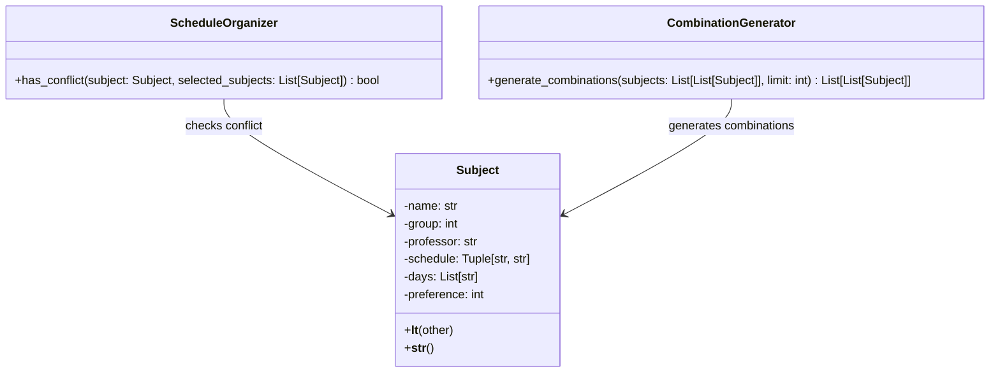
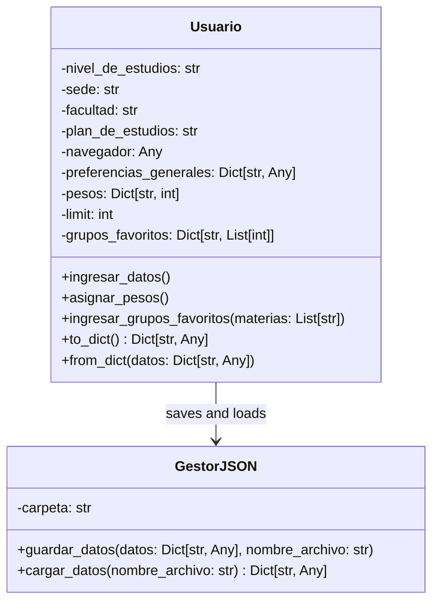
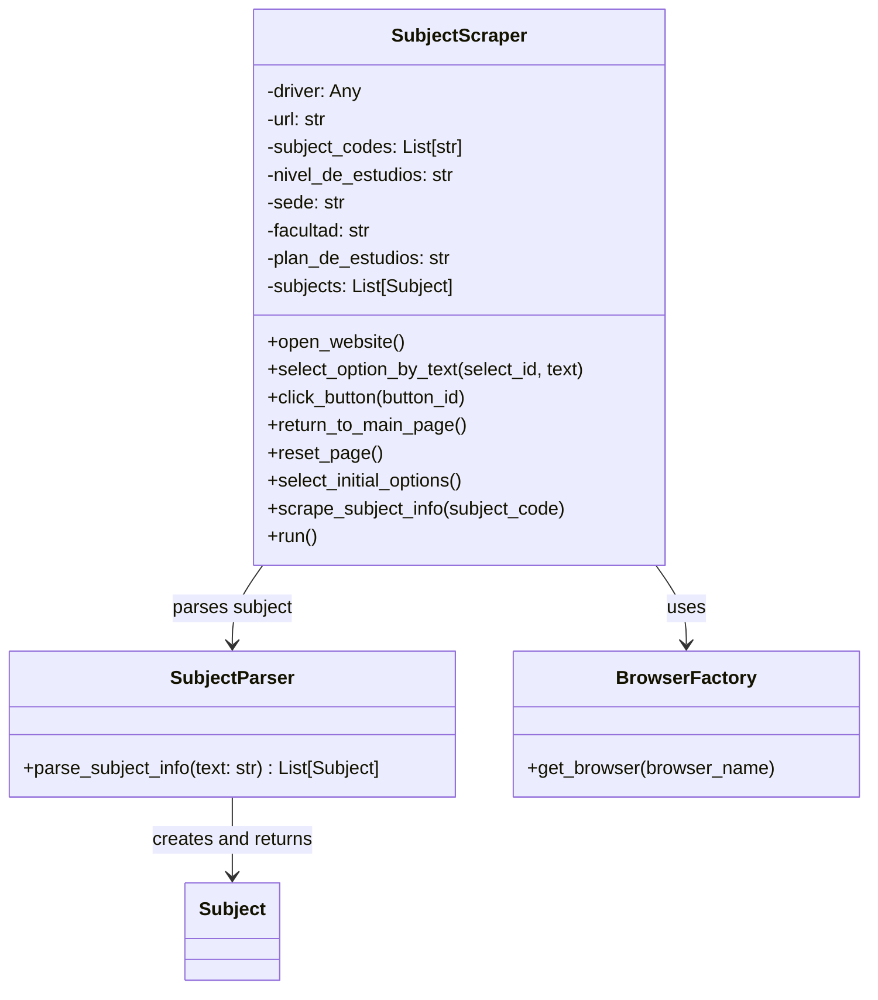

# Generador-de-Horarios-UNAL
Proyecto desarrollado en el curso de Programación Orientada a Objetos (POO) - 2024-2S.

## Tabla de Contenidos
1. [Introducción](#introducción)
2. [Problema a Resolver](#problema-a-resolver)
3. [Solución Propuesta](#solución-propuesta)
4. [Principios de Programación Utilizados](#principios-de-programación-utilizados)
   - [Programación Orientada a Objetos](#programación-orientada-a-objetos)
   - [Patrones de Diseño](#patrones-de-diseño)
5. [Arquitectura del Proyecto](#arquitectura-del-proyecto)
   - [Diagrama de Clases](#diagrama-de-clases)
   - [Estructura del Proyecto](#estructura-del-proyecto)
6. [Interfaz Gráfica de Usuario (GUI)](#interfaz-gráfica-de-usuario-gui)
7. [Requisitos de Instalación](#requisitos-de-instalación)
8. [Ejemplo de Uso](#ejemplo-de-uso)
9. [Conclusiones](#conclusiones)

---

## Introducción
Breve explicación sobre el proyecto, su propósito y contexto general.
Este proyecto tiene el propósito de servirle a los estudiantes de la Universidad Nacional de Colombia con la creación de horarios para sus materias con base a preferencias personales.

## Problema a Resolver
Al momento de inscribir materias, a parte de seleccionarlas, debe seleccionar un grupo específico que este a su vez trae un horario. El estudiante puede presentar el problema de tener un conflicto de horarios, por lo que el proyecto se enfoca en aliviar esta carga y proporcionarle al estudiante la cantidad de opciones de horarios diferentes que desea, siendole este útil y evitándole problemas de estrés en la corta franja de inscripción de materias en el SIA.

## Solución a la Propuesta
Explicación de cómo se ha abordado el problema, mencionando las estrategias implementadas.

## Principios de Programación Utilizados
### Programación Orientada a Objetos
- Explicación de las clases principales utilizadas y su relación.
1. `Subject`: Representa una materia con atributos clave. Se comparan objetos `Subject` con < para así establecer un orden en base a la preferencia. Esto será útil para la estructura heap como se verá más adelante.
2. `ScheduleOrganizer`: Maneja el conflicto de horarios verificando si una materia se cruza con otras ya seleccionadas.
3. `CombinationGenerator`: Usa una cola `heap` para priorizar combinaciones con mayor preferencia total, luego ordena los horarios generados y devuelve las mejores combinaciones.
4. `Usuario`: Representa al estudiante con sus datos acádemicos y preferencias.
5. `GestorJSON`: Manejo de datos del usuario.
6. `SubjectScraper`: Extrae la información necesaria desde el buscador de cursos del SIA (web).
7. `SubjectParser`: Procesa los datos obtenidos por el scraper.
8. `BrowserFactory`: Crea instancias de navegadores para el scraper.
- A modo general, tenemos la clase `SubjectParser` la cual estructura los datos extraídos por `SubjectScraper`. La primera clase crea múltiples instancias de `Subject`. El estudiante a través de `Usuario` define las preferencias que afectan la generación de horarios en `CombinationGenerator`. Finalmente `GestorJSON` maneja la gestión de los datos del usuario, permitiendo su almacenamiento para su uso en la aplicación.
- Conceptos aplicados como encapsulamiento, herencia y polimorfismo.

### Patrones de Diseño
- Explicación de patrones de diseño empleados (si aplica), como iteradores, generadores o decoradores.

## Arquitectura del Proyecto
### Diagrama de Clases
- Representación general de la estructura del sistema y sus relaciones.

Clases `Subject`, `ScheduleOrganizer` y `CombinationGenerator`. 

Clases `Usuario` y `GestorJSON`.

Clases `SubjectScraper`, `SubjectParser` y `BrowserFactory`.

### Estructura del Proyecto
- Explicación de la organización de archivos y carpetas.

## Interfaz Gráfica de Usuario (GUI)
- Descripción de la GUI desarrollada y cómo mejora la experiencia del usuario.
- Capturas de pantalla (si aplica).

## Requisitos de Instalación
Pasos detallados para instalar y configurar el entorno de desarrollo:
```bash
# Clonar el repositorio
git clone https://github.com/usuario/proyecto.git
cd proyecto

# Crear entorno virtual
python -m venv env

# Activar entorno virtual
# En Windows:
env\Scripts\activate
# En macOS/Linux:
source env/bin/activate

# Instalar dependencias
pip install -r requirements.txt
```

## Ejemplo de Uso
Ejemplo de cómo ejecutar el programa y utilizar sus funcionalidades principales.

## Conclusiones
Resumen de lo aprendido y futuras mejoras que podrían implementarse en el proyecto.

