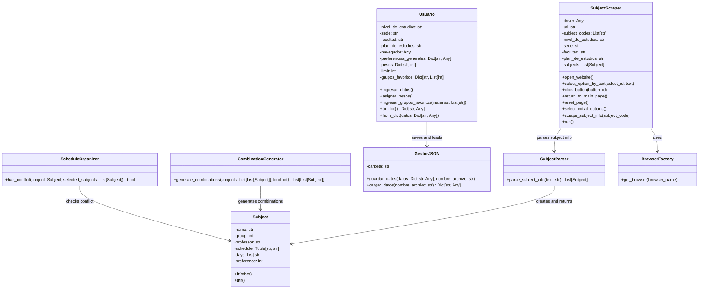

# Generador-de-Horarios-UNAL
Proyecto desarrollado en el curso de Programación Orientada a Objetos (POO) - 2024-2S.

## Tabla de Contenidos
1. [Introducción](#introducción)
2. [Problema a Resolver](#problema-a-resolver)
3. [Solución Propuesta](#solución-propuesta)
4. [Principios de Programación Utilizados](#principios-de-programación-utilizados)
   - [Programación Orientada a Objetos](#programación-orientada-a-objetos)
   - [Patrones de Diseño](#patrones-de-diseño)
5. [Arquitectura del Proyecto](#arquitectura-del-proyecto)
   - [Diagrama de Clases](#diagrama-de-clases)
   - [Estructura del Proyecto](#estructura-del-proyecto)
6. [Interfaz Gráfica de Usuario (GUI)](#interfaz-gráfica-de-usuario-gui)
7. [Requisitos de Instalación](#requisitos-de-instalación)
8. [Ejemplo de Uso](#ejemplo-de-uso)
9. [Conclusiones](#conclusiones)

---

## Introducción
El proceso de inscripción de materias en la Universidad Nacional de Colombia (UNAL) puede ser un desafío, ya que los estudiantes deben seleccionar grupos específicos y evitar conflictos de horarios en una franja de tiempo reducida. Este proyecto automatiza la generación de combinaciones de horarios óptimos para reducir el estrés y mejorar la planificación académica.

## Problema a Resolver
Durante la inscripción de materias en el SIA UNAL, los estudiantes deben:

1. Seleccionar las materias requeridas.
2. Elegir un grupo específico con un horario determinado.
3. Evitar conflictos entre horarios.
4. Optimizar su horario según preferencias personales (mañana/tarde, días específicos, profesores, etc.).

Este proyecto facilita el proceso generando múltiples combinaciones de horarios sin solapamientos y ordenadas por preferencia.

## Solución a la Propuesta
Se ha desarrollado un sistema basado en Programación Orientada a Objetos (POO) que:
- Extrae datos de las materias y sus horarios usando Web Scraping.
- Utiliza estructuras de datos eficientes como heaps para optimizar la generación de combinaciones.
- Permite a los estudiantes establecer criterios personalizados para generar un horario ideal.

## Principios de Programación Utilizados
### Programación Orientada a Objetos
- Explicación de las clases principales utilizadas y su relación.
1. `Subject`: Representa una materia con atributos clave. Se comparan objetos `Subject` con < para así establecer un orden en base a la preferencia. Esto será útil para la estructura heap como se verá más adelante.
2. `ScheduleOrganizer`: Maneja el conflicto de horarios verificando si una materia se cruza con otras ya seleccionadas.
3. `CombinationGenerator`: Usa una cola `heap` para priorizar combinaciones con mayor preferencia total, luego ordena los horarios generados y devuelve las mejores combinaciones.
4. `Usuario`: Representa al estudiante con sus datos acádemicos y preferencias.
5. `GestorJSON`: Manejo de datos del usuario.
6. `SubjectScraper`: Extrae la información necesaria desde el buscador de cursos del SIA (web).
7. `SubjectParser`: Procesa los datos obtenidos por el scraper.
8. `BrowserFactory`: Crea instancias de navegadores para el scraper.
- A modo general, tenemos la clase `SubjectParser` la cual estructura los datos extraídos por `SubjectScraper`. La primera clase crea múltiples instancias de `Subject`. El estudiante a través de `Usuario` define las preferencias que afectan la generación de horarios en `CombinationGenerator`. Finalmente `GestorJSON` maneja la gestión de los datos del usuario, permitiendo su almacenamiento para su uso en la aplicación.
- Conceptos aplicados como encapsulamiento, herencia y polimorfismo.

### Patrones de Diseño
- Explicación de patrones de diseño empleados (si aplica), como iteradores, generadores o decoradores.

## Arquitectura del Proyecto
### Diagrama de Clases
- Representación general de la estructura del sistema y sus relaciones.

Clases `Subject`, `ScheduleOrganizer` y `CombinationGenerator`. 

Clases `Usuario` y `GestorJSON`.

Clases `SubjectScraper`, `SubjectParser` y `BrowserFactory`.

### Estructura del Proyecto
```
 Generador-de-Horarios-UNAL
 ├──  generator               # Main source code
 │   ├── app                 # Main modules
 │   │   ├── app.py             # Main app file
 │   │   ├── browser_factory.py # Selenium Handling
 │   │   ├── combination_generator.py  # Generation of combinations
 │   │   ├── preference_calculator.py  # Preference calculation
 │   │   ├── schedule_organizer.py  # Organization of schedules
 │   │   ├── subject_parser.py   # Subject analysis
 │   │   ├── subject_scraper.py  # SIA Web Scraping
 │   │   ├── subject.py          # Class Subject
 │   │   ├── user.py             # Class Usuario
 │   ├── interface            # Graphic interface
 │   │   ├── __init__.py
 │   │   ├── button.py
 │   │   ├── checkbox.py
 │   │   ├── checkbox_group.py
 │   │   ├── circle.py
 │   │   ├── dropdown.py
 │   │   ├── file_selector.py
 │   │   ├── interface.py
 │   │   ├── page_manager.py
 │   │   ├── popupmenu.py
 │   │   ├── progress_bar.py
 │   │   ├── radio_group.py
 │   │   ├── rectangle.py
 │   │   ├── slider.py
 │   │   ├── switch.py
 │   │   ├── table.py
 │   │   ├── text_area.py
 │   │   ├── text_element.py
 │   │   ├── widget.py
 │   ├── __init__.py
 │   ├── main.py                 # Project entry point
 ├── .gitignore                  # Files ignored by Git
 ├── Dockerfile                  # Configuration for Docker
 ├── LICENSE                     # Project License
 ├── README.md                   # Documentation
 ├── requirements.txt             # Project Dependencies
```
## Interfaz Gráfica de Usuario (GUI)
1. Cómo funciona la interfaz
[Cómo funciona la interfaz](/img/Instrucciones.mp4)
2. Agregar la información del estudiante
[Agregar la información del estudiante](/img/Info_usuario.mp4)
3. Agregar materias y elegir preferencias
[Agregar materias y elegir preferencias](/img/Scraping.mp4)
4. Generar horarios
[Generar horarios](/img/generar_combinaciones.mp4)


## Requisitos de Instalación
### Entorno virtual
Pasos detallados para instalar y configurar el entorno de desarrollo:
1. Clonar el repositorio.
```bash
git clone https://github.com/Gafesato/Generador-de-Horarios-UNAL.git
cd generador_horarios_unal
```
2. Crear entorno virtual
```
python -m venv env

# Activate virtual environment
# On Windows:
env\Scripts\activate
# On macOS/Linux:
source env/bin/activate
```
3. Instalar dependencias.
```
pip install -r requirements.txt
```
### Usar Docker
Se debe tener descargado [Docker](https://docs.docker.com/desktop/setup/install/windows-install/).
1. Construir la imagen de Docker.
Esperar a que el proceso finalice (Aprox. 5 minutos)
```
docker build -t generador-horarios .
```
2. Ejecutar un contenedor basado en la imagen.
```
docker run --rm -it -p 8080:8080 generador-horarios
```
## Ejemplo de Uso (Entorno Virtual)
El directorio actual debe ser `Generador-de-Horarios-UNAL`.
```bash
python -m generator.main
```

## Conclusiones
Este proyecto automatiza la creación de horarios optimizados para estudiantes de la UNAL, permitiendo una selección rápida y eficiente de materias sin conflictos. Se pueden implementar mejoras como una interfaz gráfica y soporte para más criterios de preferencia en futuras versiones.

---
Autores: 
- [Samuel Fernando Garzón Toro](https://github.com/Gafesato)
- [Juan Esteban Molina Rey](https://github.com/eljuanessoy)
- [Ever Nicolás Muñoz Cortés](https://github.com/nicolasmcort)
- Grupo: [ERROR404]
- Licencia: [AGPL-3.0]

